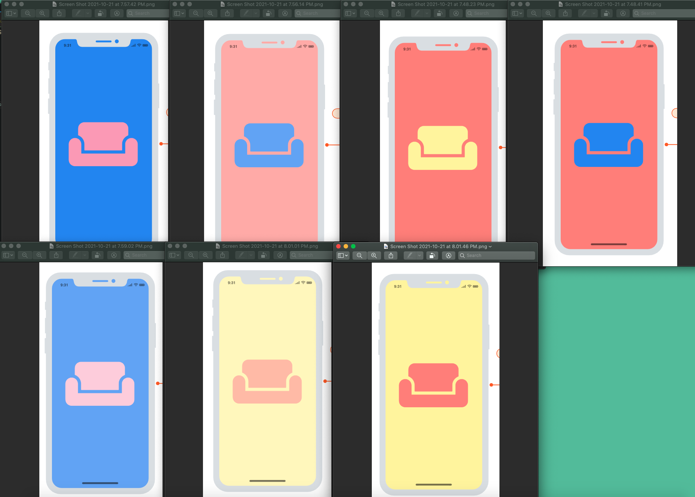
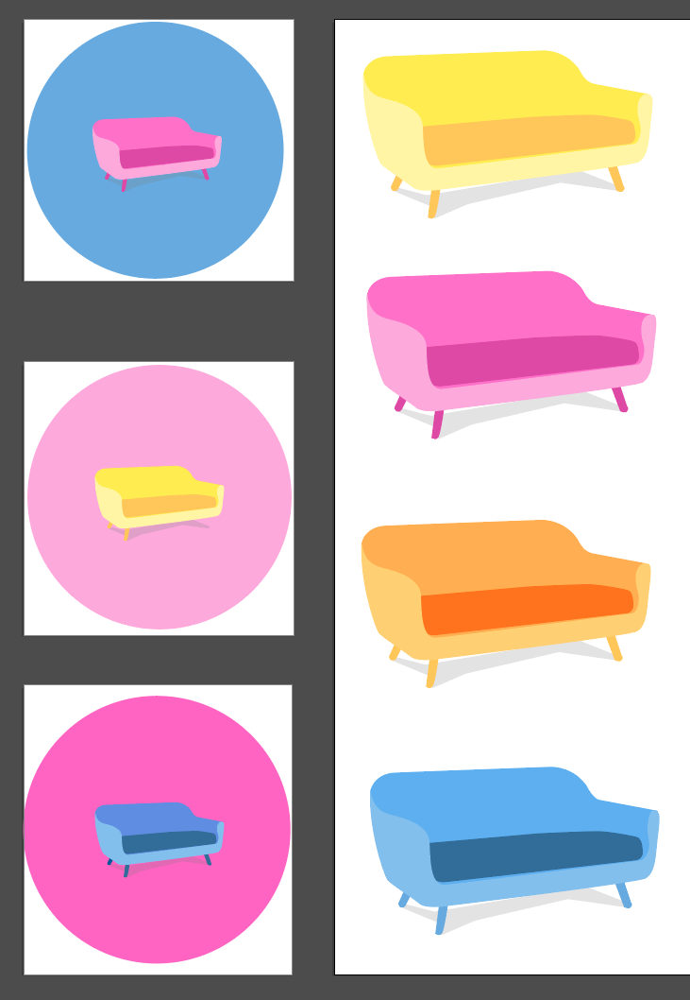

# CORE 
   - [ ] search for an item
   - [ ] Craigslist results
   - [ ] Kijiji results
   - [ ] facebook marketplace results
   - [ ] local shops results
   - [ ] major retailer results
   - [ ] divide results into categories
   - [ ] categories view
   - [ ] single category focus view
   - [ ] single item focus view
   - [ ] option to mix view
   - [ ] 

## Desktop Wire Frame

## Mobile Wire Frame

## Entity Relationship Diagram 

## Main User Stories

- When a user first enters the CloseBuy application, the user is greeted with a flash screen. The flash screen displays the CloseBuy logo and loading icon.

- When a user visits the main application home page, the user is greeted with pre-populated search results, the main search functionality and information on the CloseBuy application.

- Via the main home page, the user can view and search for local products to purchase. The search results will prioritise local and second hand market place results.

- Each product displays an icon for the user to expand the product view, and see more details on the product itself.

- If a user selects a product via a search result, the product view is displayed and highlighted for the users. Product information is displayed, such as the price, an image, description and where the product is hosted. 

- A user can filter their search via categories of stores or products.

## Stretch User Stories 

- Authenticated users can favourite / pin chosen products to the favourites board, making selected product’s easily accessible at a later date. 

- Any user can save their personal location to the CloseBuy app and search for nearest products available in regard to their personal location. Any user can filter a product search by city.

- Authenticated users can sign up to receive email correspondence that includes recommendations of new products available via the CloseBuy app based on the users recent search history and favourites board 

## Craigslist
 - node-craigslist npm
   - https://www.npmjs.com/package/node-craigslist
   - https://github.com/brozeph/node-craigslist

## Kijiji
 - node-craiglist npm
   - https://www.npmjs.com/package/kijiji-scraper
   - https://github.com/mwpenny/kijiji-scraper#readme

## Facebook Marketplace
   - not sure fb has search/marketplace api

## Local Shops
   - google shop REST api?

## Major Retailers
 - google shop REST api? 

## email
 - possibly use mail chimp
 - how hard would it be to use/make our own mail server (nodemailer?)
   - talked to mentor... its hard.

# Design
## Logo Designs
### Colour Exploration

